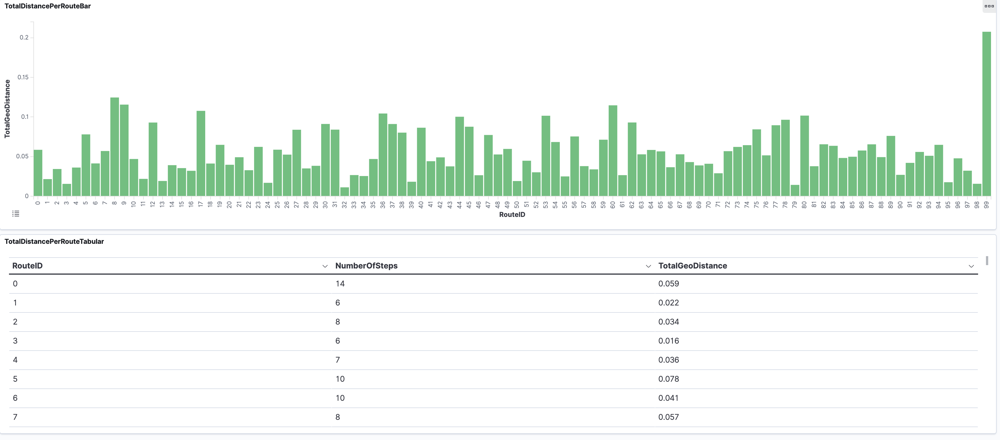
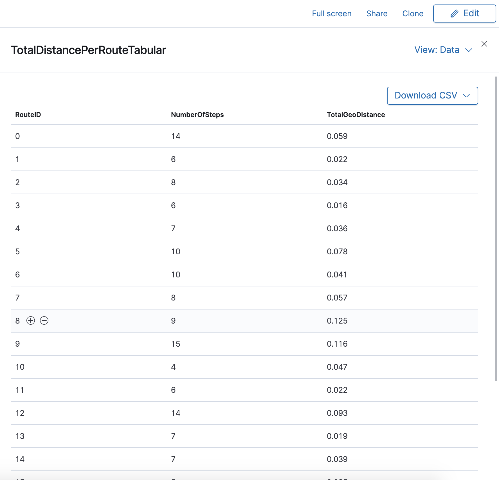

# kafka
The project aims towards doing a hands-on on confluent kafka.

### Problem Statement
There is a massive amount of GPS route data but each route only contains LineStrings for each step of the route. We should be able to know the total distance travelled for each route.

### Task 
Create a data pipeline which, when given GPS route data, reports the distance travelled for each route.

### Input
The GPS route data will be a .tsv file with only 3 columns defined in the table below:

| Name | Description | Type |
| ----------- | ----------- | ----------- |
| route | Unique identifier for each route | string |
| step | Step number for a given route | 32 bit integer |
| geom | LineString data for a given step of a given route | WKT string |

Sample input file: https://amp-technical-challenge.s3.amazonaws.com/routes.tsv
 
### Output
The output of the data pipeline should be a file with 3 columns as defined below:

| Name | Description | Type |
| ----------- | ----------- | ----------- |
| route | Unique identifier for each route | string |
| step_count | Total number of steps in a route | 32 bit integer |
| distance | Total distance of the route | 64 bit integer |

## Proposed Solution
I used confluent kafka as a pub-sub mechanism to cater to the problem. As a preface to the kafka broker there would be a producer application which would read the input tsv and send data to "routes_json" topic. The data sent would be JSON serialised(JSON_SR). For POC purpose, I have kept the partitions and replications to be 1 for all topics including "routes_json". 
Then a consumer application (based off of kafka-python) subscribes to the "routes_json" topic and transforms the WKT LineString into readable distance using Shapely module. The transformed data is sent back to the kafka broker to a topic called "reroutes_json". The data here as well is sent in a JSON_SR fashion.
The transformed data is then to be sent to ElasticSearch so that Kibana can built reports over it. For this purpose, I used KSQL to create an ElasticSearch sink.
Following is a diagramatic representation of the above:

## Kibana Visualisation and Report

On the right corner of the panel, click on the 3-dot icon => inspect, you should see a Download CSV option for the visualised data:

## Usage Notes

1. use **docker-compose up -d** to run the containers and **docker-compose ps** to check the status of the containers running.
2. use **docker-compose stop** to stop all containers and **docker-compose down** to stop and remove networks, volumes, and images created by up.
3. use **docker cp somefilename.tsv transformer:/home/app** to copy the input file into the running transformer container for processing.
4. use **docker exec -it transformer python json_producer.py config_json.ini --file somefilename.tsv** to process the file
5. to create the Elastic sink connector, do the following:
   1. open a new terminal window.
   2. use **docker exec -it ksqldb ksql http://ksqldb:8088** to get ksql CLI.
   3. use the following to create connector the first time you are running the containers:
        `CREATE SINK CONNECTOR ELASTIC_SINK_REROUTES_JSON WITH (
        'connector.class'         = 'io.confluent.connect.elasticsearch.ElasticsearchSinkConnector',
        'connection.url'          = 'http://elasticsearch:9200',
        'key.converter'           = 'org.apache.kafka.connect.storage.StringConverter',
        'value.converter'         = 'io.confluent.connect.json.JsonSchemaConverter',
        'value.converter.schema.registry.url' = 'http://schema-registry:8081',
        	'type.name'               = '_doc',
        'topics'                  = 'reroutes_json',
        'key.ignore'              = 'false',
        'schema.ignore'           = 'false'
	    );`
6. use **print reroutes_json from beginning limit 10;** on ksql CLI to check the key/value schema and serialization and the data in the topic reroutes_json.
7. use **curl -s http://localhost:9200/reroutes_json/_search  -H 'content-type: application/json' -d '{ "size": 5000  }' | jq -c '.hits.hits[]'** to check all the data sent to elasticsearch from the topic reroutes_json.
